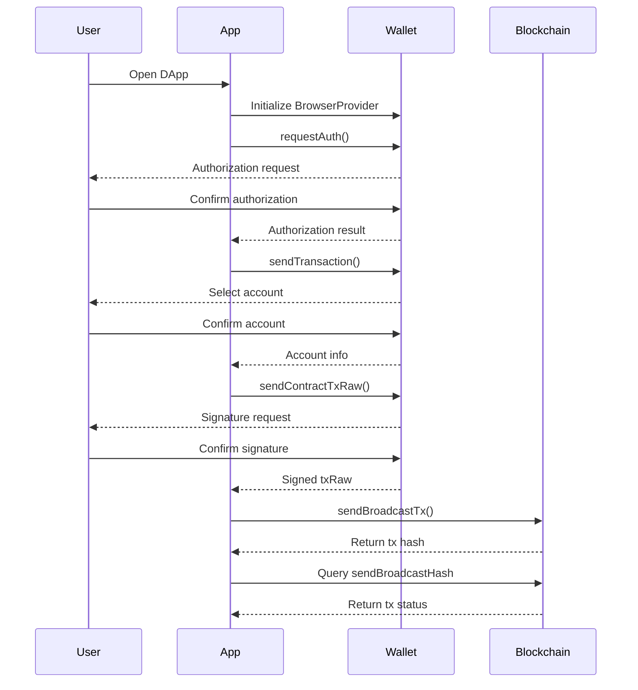
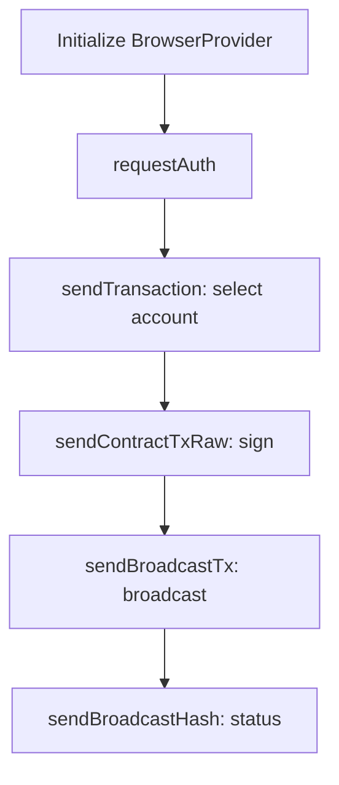

## End-to-End Flow Overview

- Step 1: Initialize `BrowserProvider`
  - Create and configure the browser provider instance
- Step 2: Call `requestAuth` to authorize
  - Obtain user wallet authorization
- Step 3: Call `sendTransaction` to select account
  - Open account list and choose a transaction account
- Step 4: Call `sendContractTxRaw` to sign contract transaction
  - Build and sign contract method transaction
- Step 5: Broadcast with `sendBroadcastTx`
  - Submit signed transaction to the network
- Step 6: Query status via `sendBroadcastHash`
  - Track confirmation status via transaction hash

## Sequence Diagram (Mermaid)



## Flowchart (Mermaid)



## Step-by-Step Implementation

### 1.Initialize BrowserProvider

```javascript
import * as miniProgramApi from 'mini-program-api'

let provider;
function initProvider() {
  if (typeof window !== 'undefined' && (window).noChain) {
    provider = new miniProgramApi.BrowserProvider((window).noChain);
  } else {
    throw { code: 'E_PROVIDER_NOT_FOUND', message: 'Wallet provider not found' };
  }
}

initProvider();
```

- Parameters: `noChain` (injected wallet provider)
- Returns: `BrowserProvider` instance
- Errors: `E_PROVIDER_NOT_FOUND` when wallet is not available

### 2.requestAuth: obtain authorization

```javascript
const authResult = await provider.requestAuth({
  type: 'auth_account',
  scope: 'userInfo',
});

if (!authResult.success) {
  throw { code: 'E_AUTH_REJECTED', message: authResult.error || 'Authorization rejected' };
}

const { accountId } = authResult;
```

- Required params: `type: string` (e.g., `auth_account`)
- Optional params: `scope?: string` (e.g., `userInfo`)
- Returns: `{ success, accountId, data?, error? }`
- Errors: `E_AUTH_REJECTED` when user denies or fails authorization

### 3.sendTransaction: select account

```javascript
// Open account list for selection by setting open_account_list: true
const result = await provider.sendTransaction({
  actions: {
    amount: '1000000000000000000000000', // example amount
    symbol: 'TDW20',
    fee_symbol: 'TDW20',
  },
  recipient_account_id: 'receiver.account',
  open_account_list: true,
});

if (!result.success) {
  throw { code: 'E_TX_PREPARE_FAILED', message: result.error || 'Transaction preparation failed' };
}
```

- Required params: `actions.amount`, `actions.symbol`, `actions.fee_symbol`, `recipient_account_id`
- Optional params: `open_account_list: boolean`, `actions.max_gas`
- Returns: `{ success, accountId, data? }`
- Errors: `E_TX_PREPARE_FAILED` if selection or preparation fails

### 4.sendContractTxRaw: build and sign contract method

```javascript
const contractTx = await provider.sendContractTxRaw({
  receiverId: 'contract.account',
  sender_account_id: accountId, // from authorization
  actions: {
    method_name: 'methodName',
    args: { key: 'value' },
    max_gas: 300000000000000,
    amount: '', // optional if pure call
    symbol: 'TDW20',
    fee_symbol: 'TDW20',
  },
});

if (!(contractTx.success) || contractTx.error) {
  throw { code: 'E_SIGN_DENIED', message: contractTx.error || 'Signature denied' };
}

const { txRaw } = contractTx.data;
```

- Required params: `receiverId`, `actions.method_name`, `actions.args`
- Optional params: `actions.max_gas`, `actions.amount`, `actions.symbol`, `actions.fee_symbol`
- Returns: `{ success, data: { txRaw }, error? }`
- Errors: `E_SIGN_DENIED` when user rejects signature or signing fails

### 5.sendBroadcastTx: broadcast the signed transaction

```javascript
const broadcast = await provider.sendBroadcastTx({ txRaw });
if (!broadcast.success) {
  throw { code: 'E_BROADCAST_FAILED', message: broadcast.error || 'Broadcast failed' };
}

const { hash } = broadcast.data;
```

- Required params: `txRaw`
- Returns: `{ success, data: { hash }, error? }`
- Errors: `E_BROADCAST_FAILED` when network submission fails

### 6.sendBroadcastHash: track transaction status

```javascript
const status = await provider.sendBroadcastHash({ hash });
if (!status.success) {
  throw { code: 'E_TX_FAILED', message: status.error || 'Transaction failed' };
}

// status.data may include confirmation info
```

- Required params: `hash: string`
- Returns: `{ success, data: { success: boolean, msg?: string }, error? }`
- Notes: Automatically polls every 2s for up to ~6 minutes

## Dependencies Between Steps

- Provider init must happen before any wallet call.
- Authorization precedes any transaction or signature requests.
- Account selection (sendTransaction) precedes contract signing if the sender is chosen interactively.
- `sendContractTxRaw` produces `txRaw`, which is required by `sendBroadcastTx`.
- `sendBroadcastTx` returns `hash`, required by `sendBroadcastHash`.

## Internationalization (i18n)

- Provide CN/EN text via i18n keys; ensure UI prompts and errors are localized.
- Error messages should include internationalized error codes.

```json
// i18n/en.json
{
  "flow.init": "Initializing wallet provider",
  "flow.auth": "Requesting authorization",
  "flow.selectAccount": "Select an account",
  "flow.sign": "Sign contract transaction",
  "flow.broadcast": "Broadcasting transaction",
  "flow.status": "Checking transaction status",
  "error.E_PROVIDER_NOT_FOUND": "Wallet provider not found",
  "error.E_AUTH_REJECTED": "Authorization rejected",
  "error.E_SIGN_DENIED": "Signature was denied",
  "error.E_BROADCAST_FAILED": "Broadcast failed",
  "error.E_TX_FAILED": "Transaction failed"
}
```

```json
// i18n/zh.json
{
  "flow.init": "初始化錢包提供者",
  "flow.auth": "進行授權",
  "flow.selectAccount": "選擇交易帳戶",
  "flow.sign": "簽署合約交易",
  "flow.broadcast": "廣播交易",
  "flow.status": "查詢交易狀態",
  "error.E_PROVIDER_NOT_FOUND": "未找到錢包提供者",
  "error.E_AUTH_REJECTED": "授權被拒絕",
  "error.E_SIGN_DENIED": "使用者拒絕簽名",
  "error.E_BROADCAST_FAILED": "交易廣播失敗",
  "error.E_TX_FAILED": "交易執行失敗"
}
```

Usage example in UI code:

```javascript
import { t } from './i18n';

try {
  // ... steps
} catch (err) {
  showToast(t(`error.${err.code}`));
}
```

## Error Handling

- Use `try/catch` around each step and map errors to i18n codes.
- Common codes: `E_PROVIDER_NOT_FOUND`, `E_AUTH_REJECTED`, `E_TX_PREPARE_FAILED`, `E_SIGN_DENIED`, `E_BROADCAST_FAILED`, `E_TX_FAILED`, `E_NETWORK_TIMEOUT`, `E_INVALID_PARAMS`.
- Log structured errors with `{ code, message, details? }`.

## FAQ

- Wallet provider not found?
  - Ensure the environment injects `window.noChain`; check that the wallet is installed and enabled.
- Authorization keeps failing?
  - Verify `type` and `scope` values; confirm the user is logged in and did not deny the prompt.
- Signature rejected by user?
  - Respect the user decision; surface a retry option and record `E_SIGN_DENIED`.
- Transaction stuck pending?
  - Recheck network status; use `sendBroadcastHash` polling and consider increasing `max_gas` if applicable.
- Wrong token or fee token?
  - Confirm `symbol` and `fee_symbol` are valid and supported by the wallet/network.
