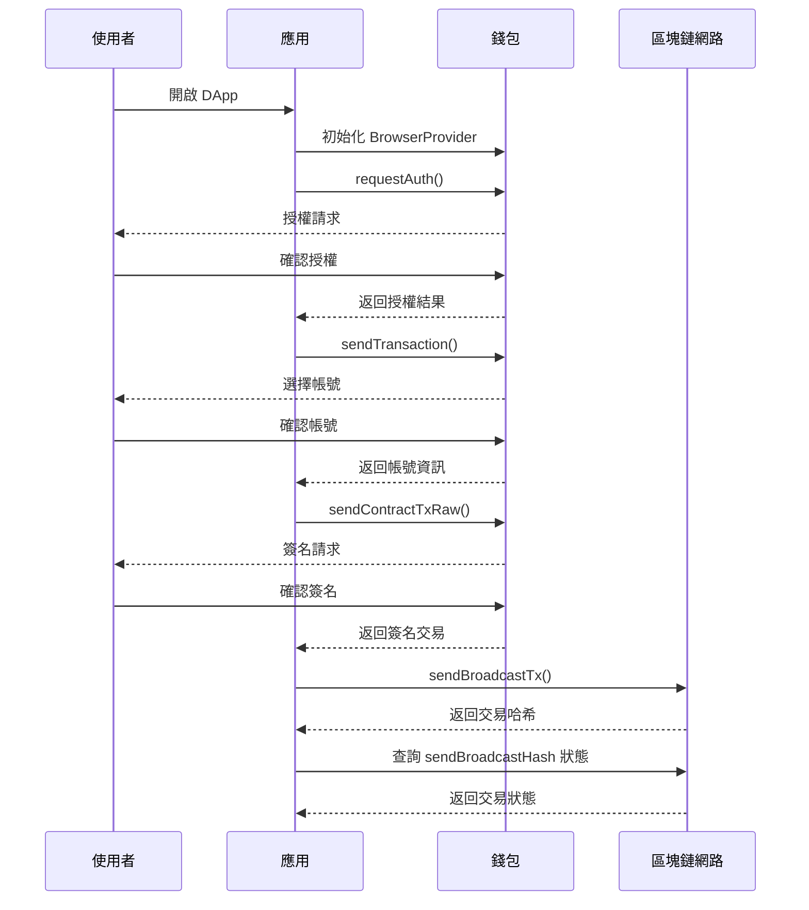
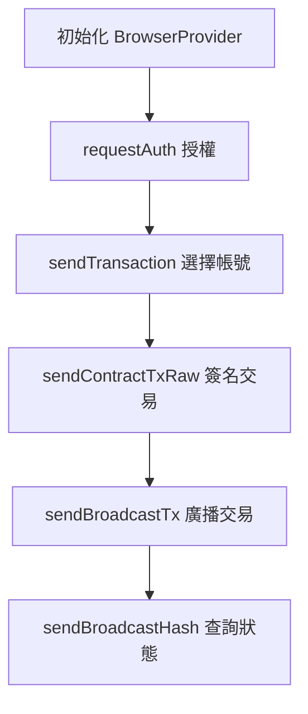

## 端到端流程概覽

- 第一步：初始化 `BrowserProvider`
  - 建立並配置瀏覽器提供者實例
- 第二步：呼叫 `requestAuth` 進行授權
  - 取得使用者錢包授權
- 第三步：呼叫 `sendTransaction` 選擇帳號
  - 拉起帳號列表並選擇交易帳號
- 第四步：呼叫 `sendContractTxRaw` 發起簽名交易
  - 構造並簽署智慧合約交易
- 第五步：使用 `sendBroadcastTx` 廣播交易
  - 將簽名後的交易提交至網路
- 第六步：透過 `sendBroadcastHash` 查詢交易狀態
  - 透過交易哈希追蹤交易確認狀態

## 時序圖（Mermaid）



## 流程圖（Mermaid）



## 實作步驟詳解

### 1.初始化 BrowserProvider

```javascript
import * as miniProgramApi from 'mini-program-api'

let provider;
function initProvider() {
  if (typeof window !== 'undefined' && (window).noChain) {
    provider = new miniProgramApi.BrowserProvider((window).noChain);
  } else {
    throw { code: 'E_PROVIDER_NOT_FOUND', message: '未找到錢包提供者' };
  }
}

initProvider();
```

- 參數：`noChain`（由環境注入的錢包提供者）
- 返回：`BrowserProvider` 實例
- 錯誤：當無法取得錢包時回傳 `E_PROVIDER_NOT_FOUND`

### 2.requestAuth：取得授權

```javascript
const authResult = await provider.requestAuth({
  type: 'auth_account',
  scope: 'userInfo',
});

if (!authResult.success) {
  throw { code: 'E_AUTH_REJECTED', message: authResult.error || '授權被拒絕' };
}

const { accountId } = authResult;
```

- 必填參數：`type: string`（例如 `auth_account`）
- 選填參數：`scope?: string`（例如 `userInfo`）
- 返回：`{ success, accountId, data?, error? }`
- 錯誤：使用者拒絕或授權失敗時 `E_AUTH_REJECTED`

### 3.sendTransaction：選擇帳號

```javascript
// 設定 open_account_list: true 以拉起帳號選擇介面
const result = await provider.sendTransaction({
  actions: {
    amount: '1000000000000000000000000',
    symbol: 'TDW20',
    fee_symbol: 'TDW20',
  },
  recipient_account_id: 'receiver.account',
  open_account_list: true,
});

if (!result.success) {
  throw { code: 'E_TX_PREPARE_FAILED', message: result.error || '交易準備失敗' };
}
```

- 必填參數：`actions.amount`、`actions.symbol`、`actions.fee_symbol`、`recipient_account_id`
- 選填參數：`open_account_list`、`actions.max_gas`
- 返回：`{ success, accountId, data? }`
- 錯誤：選擇或準備失敗時 `E_TX_PREPARE_FAILED`

### 4.sendContractTxRaw：構造並簽署合約方法

```javascript
const contractTx = await provider.sendContractTxRaw({
  receiverId: 'contract.account',
  sender_account_id: accountId,
  actions: {
    method_name: 'methodName',
    args: { key: 'value' },
    max_gas: 300000000000000,
    amount: '',
    symbol: 'TDW20',
    fee_symbol: 'TDW20',
  },
});

if (!(contractTx.success) || contractTx.error) {
  throw { code: 'E_SIGN_DENIED', message: contractTx.error || '使用者拒絕簽名' };
}

const { txRaw } = contractTx.data;
```

- 必填參數：`receiverId`、`actions.method_name`、`actions.args`
- 選填參數：`actions.max_gas`、`actions.amount`、`actions.symbol`、`actions.fee_symbol`
- 返回：`{ success, data: { txRaw }, error? }`
- 錯誤：使用者拒絕或簽名失敗時 `E_SIGN_DENIED`

### 5.sendBroadcastTx：廣播簽名交易

```javascript
const broadcast = await provider.sendBroadcastTx({ txRaw });
if (!broadcast.success) {
  throw { code: 'E_BROADCAST_FAILED', message: broadcast.error || '交易廣播失敗' };
}

const { hash } = broadcast.data;
```

- 必填參數：`txRaw`
- 返回：`{ success, data: { hash }, error? }`
- 錯誤：網路提交失敗時 `E_BROADCAST_FAILED`

### 6) sendBroadcastHash：查詢交易狀態

```javascript
const status = await provider.sendBroadcastHash({ hash });
if (!status.success) {
  throw { code: 'E_TX_FAILED', message: status.error || '交易執行失敗' };
}

// status.data 可能包含確認資訊
```

- 必填參數：`hash: string`
- 返回：`{ success, data: { success: boolean, msg?: string }, error? }`
- 說明：每 2 秒自動輪詢，最長約 6 分鐘

## 步驟依賴關係

- 任何錢包操作前必須先初始化提供者。
- 授權在交易或簽名請求之前進行。
- 若需互動選擇發送帳號，必須先執行 `sendTransaction`。
- `sendContractTxRaw` 會產出 `txRaw`，供 `sendBroadcastTx` 使用。
- `sendBroadcastTx` 返回 `hash`，供 `sendBroadcastHash` 查詢。

## 國際化（i18n）

- 以 i18n key 管理中英文文案；所有互動提示與錯誤需支援多語。
- 錯誤訊息需包含國際化錯誤碼。

```json
// i18n/en.json
{
  "flow.init": "Initializing wallet provider",
  "flow.auth": "Requesting authorization",
  "flow.selectAccount": "Select an account",
  "flow.sign": "Sign contract transaction",
  "flow.broadcast": "Broadcasting transaction",
  "flow.status": "Checking transaction status",
  "error.E_PROVIDER_NOT_FOUND": "Wallet provider not found",
  "error.E_AUTH_REJECTED": "Authorization rejected",
  "error.E_SIGN_DENIED": "Signature was denied",
  "error.E_BROADCAST_FAILED": "Broadcast failed",
  "error.E_TX_FAILED": "Transaction failed"
}
```

```json
// i18n/zh.json
{
  "flow.init": "初始化錢包提供者",
  "flow.auth": "進行授權",
  "flow.selectAccount": "選擇交易帳戶",
  "flow.sign": "簽署合約交易",
  "flow.broadcast": "廣播交易",
  "flow.status": "查詢交易狀態",
  "error.E_PROVIDER_NOT_FOUND": "未找到錢包提供者",
  "error.E_AUTH_REJECTED": "授權被拒絕",
  "error.E_SIGN_DENIED": "使用者拒絕簽名",
  "error.E_BROADCAST_FAILED": "交易廣播失敗",
  "error.E_TX_FAILED": "交易執行失敗"
}
```

UI 使用範例：

```javascript
import { t } from './i18n';

try {
  // ... 流程步驟
} catch (err) {
  showToast(t(`error.${err.code}`));
}
```

## 異常處理

- 各步驟以 `try/catch` 包覆並映射到 i18n 錯誤碼。
- 常見錯誤碼：`E_PROVIDER_NOT_FOUND`、`E_AUTH_REJECTED`、`E_TX_PREPARE_FAILED`、`E_SIGN_DENIED`、`E_BROADCAST_FAILED`、`E_TX_FAILED`、`E_NETWORK_TIMEOUT`、`E_INVALID_PARAMS`。
- 建議記錄結構化錯誤 `{ code, message, details? }`。

## 常見問題（FAQ）

- 找不到錢包提供者？
  - 確認環境已注入 `window.noChain`；檢查錢包安裝並啟用。
- 授權一直失敗？
  - 檢查 `type` 與 `scope` 參數；確認使用者已登入且未拒絕授權。
- 使用者拒絕簽名？
  - 尊重使用者決定；提供重試選項並記錄 `E_SIGN_DENIED`。
- 交易長時間為待處理？
  - 檢查網路狀態；使用 `sendBroadcastHash` 輪詢並視需要調整 `max_gas`。
- 手續費或代幣設定錯誤？
  - 確認 `symbol` 與 `fee_symbol` 合法且受錢包/網路支援。